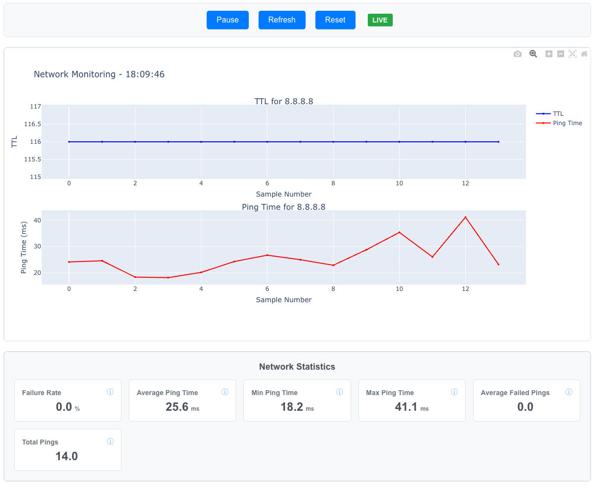

# Network Ping Monitor

A real-time network monitoring tool that pings a target IP and displays live statistics with interactive charts.

## Features

- **Real-time ping monitoring** with live data updates
- **Interactive charts** showing ping times and TTL values
- **Live statistics** including average ping time, failure rate, and more
- **Pause/resume functionality** to control monitoring
- **Reset statistics** to start fresh
- **Dual frontend support** - React and Vue.js versions

## Web Interface



## Quick Start

### Option 1: Vue.js Frontend (Recommended)

```bash
# Install Python dependencies
pip install -r requirements.txt

# Install Vue.js dependencies
cd frontend-vue && npm install && cd ..

# Start both backend and Vue.js frontend
./start-vue.sh
```

### Option 2: React Frontend

```bash
# Install Python dependencies
pip install -r requirements.txt

# Install React dependencies
cd frontend-react && npm install && cd ..

# Start both backend and React frontend
./start-react.sh
```

The application will be available at:
- **Frontend**: http://localhost:3000
- **API**: http://localhost:5000

## Manual Start

### Backend Only

```bash
# Start Flask backend
python main.py
```

### Frontend Only

```bash
# Vue.js frontend
cd frontend-vue && npm run serve

# React frontend
cd frontend-react && npm start
```

## API Endpoints

- `GET /api/data` - Get current network statistics and chart data
- `GET /api/config` - Get application configuration
- `POST /api/reset` - Reset all statistics

## Frontend Comparison

| Feature | React Version | Vue.js Version |
|---------|---------------|----------------|
| Framework | React 18 | Vue.js 3 |
| Charts | Recharts | Chart.js + Vue-Chartjs |
| State Management | React Hooks | Vue Composition API |
| Build Tool | Create React App | Vue CLI |
| Bundle Size | Larger | Smaller |
| Performance | Good | Better |